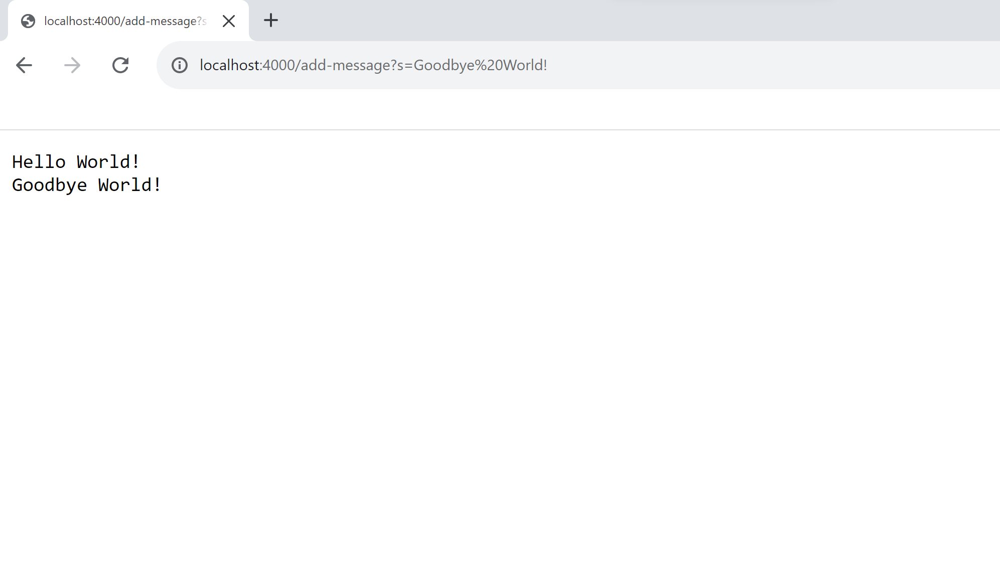

## Lab Report 2: Servers and Bugs
### Part 1: String Server
The web server, `StringServer`, is meant to take in a string through a request, in the form of `add-message?s=<string>`, and store the incoming requests in a single string, which is displayed on the page. In my writing of the web server, `StringServer`, I implemented 'URLHandler' and referenced `NumberServer`, both provided in   the wavelet repository of the Week 2 Lab at [https://github.com/ucsd-cse15l-f22/wavelet](https://github.com/ucsd-cse15l-f22/wavelet). 


Using these resource, I wrote the following code for `StringServer`:
```
import java.io.IOException;
import java.net.URI;

class Handler implements URLHandler {
    
    String string = "";

    public String handleRequest(URI url) {
        if (url.getPath().equals("/")) {
            return string;
        }
        else {
            System.out.println("Path: " + url.getPath());
            if (url.getPath().contains("/add-message")) {
                String[] parameters = url.getQuery().split("=");
                if (parameters[0].equals("s")) {
                    string += parameters[1] + "\n";
                    return string;
                }
            }
            return "404 Not Found!";
        }
    }
}

class StringServer {
    public static void main(String[] args) throws IOException {
        if(args.length == 0){
            System.out.println("Missing port number!")
            return;
        }

        int port = Integer.parseInt(args[0]);

        Server.start(port, new Handler());
    }
}
```

In order to build and run this server on my local computer, I used the terminal commands `javac Server.java StringServer.java` and `java StringServer 4000`. The message `Server Started! Visit http://localhost:4000 to visit.` prompted me to the link [http://localhost:4000](http://localhost:4000) where I was able to use the `add-message` request.  


In order for this to occur, the main method of `String Server` built the server that ran on the specific port, 4000, which was given in the terminal commands by calling on the `start` method of the `Server` class in Server.java. The `start` method took in the values `4000` for the port and `new Handler()` to build the server. 

In my first example, I added `add-message?s=Hello World!` to the URL to get [http://localhost:4000/add-message?s=Hello%20World!](http://localhost:4000/add-message?s=Hello%20World!). This produced the following result: 
>

In order for this to occur, the value of `http://localhost:4000/add-message?s=Hello%20World!` was taken as input into the `handleRequest` method. `url.getPath()` was called and since the path did not equal `/` the if statement was skipped and the else block began. Within the else block, the statement `if (url.getPath().contains("/add-message"))` returned true because the url value was `http://localhost:4000/add-message?s=Hello%20World!` and thus did contain `/add-message`. The array `parameters` was then set equal to the parts of the query `{"s", "Hello World!"}`, using `url.getQuery().split("=")`. 

Then, the first element of the array `parameters` is checked for its equality to the string `"s"`. Since the statement `parameters[0].equals("s")` returned true, the value of string, which is the string that is displayed on the page, is set equal to the previous value of string, in this case the string's previous value was empty, with the addition of the value of
`parameters[1]`, in this case being `"Hello World!"`, and `/n`, so the next time this sequence occurs the value of `parameters[1]` will print on the next line. 

Finally, the value of string is returned, displaying the value of string on the page. Hence, the value of the field, 'string', of the class changed.

In my second example, I added `add-message?s=Goodbye World!` to the URL to get [http://localhost:4000/add-message?s=Goodbye%20World!](http://localhost:4000/add-message?s=Goodbye%20World!). This produced the following result:  
>

In order for this to occur, the value of `http://localhost:4000/add-message?s=Goodbye%20World!` was taken asinput into the `handleRequest` method. `url.getPath()` was called and since the path did not equal `/` the if statement was skipped and the else block began. Within the else block, the statement `if (url.getPath().contains("/add-message"))` returned true because the url value was `http://localhost:4000/add-message?s=Hello%20World!` and thus did contain `/add-message'. The array `parameters` was then set equal to the parts of the query, `{"s", "Goodbye World!"}`, using `url.getQuery().split("=")`. 

Then, the first element of the array `parameters` is checked for its equality to the string `"s"`. Since the statement `parameters[0].equals("s")` returned true, the value of string is set equal to the previous value of string, in this case the value of the string was "Hello World!\n", with the addition of the value of
`parameters[1]`, in this case being `"Hello World!"`, and `/n`.

Finally, the value of string is returned, displaying the value of string on the page. Hence, the value of the field, 'string', of the class changed.

### Part 2: Bugs
The buggy program I will be discussing is the `reversed` method in ArrayExample.java provided in the lab3 repository at [https://github.com/ucsd-cse15l-w23/lab3](https://github.com/ucsd-cse15l-w23/lab3). The intention of this method was to return a new array of the input array's elements in reverse order. 

The following JUnit test included the failure-inducing input, `{1, 2, 3}`, for the buggy program:
```
import static org.junit.Assert.*;
import org.junit.*;

public class ArrayTests {
    
    @Test
    public void myTestReversedFail() {
        int[] failingInput = {1, 2, 3};
        assertArrayEquals(new int[]{3, 2, 1}, ArrayExample.reversed(failingInput));
    }
}
```

The following Junit test does not induce a failure, despite the buggy program: 
```
import static org.junit.Assert.*;
import org.junit.*;

public class ArrayTests {
    
    @Test
    public void myTestReversedPass() {
        int[] passingInput = {0, 0, 0};
        assertArrayEquals(new int[]{0, 0, 0}, ArrayExample.reversed(passingInput));
    }
}
```

The symptom of the buggy program, is that the returned array has values that are all equal to zero, ass seen in the following image: 
>

Previous to debugging, the `reversed` method contained the following code: 
```
static int[] reversed(int[] arr) {
   int[] newArray = new int[arr.length];
   for(int i = 0; i < arr.length; i += 1) {
     arr[i] = newArray[arr.length - i - 1];
   }
   return arr;
}
```

Following debugging, the `reversed` method contained the following code:
```
static int[] reversed(int[] arr) {
   int[] newArray = new int[arr.length];
   for(int i = 0; i < arr.length; i += 1) {
     newArray[i] = arr[arr.length - i - 1];
   }
   return newArray;
}
```

In order to debug the `reversed` method, I first changed the return statement from `return arr;` to `return newArray;`, this fixed part of the issue by returning the new array rather than the input array. Also, `arr[i] = newArray[arr.length - i - 1];` was changed to `newArray[i] = arr[arr.length - i - 1];` in order to set the element of the new array equal to the reversed elements of the input array rather than, as previous to the change, the elements of the input array being set to the elements of the new array, which were all zero.


### Part 3: Something I learned
During lab 2, I learned that it is possible to affect what other users see on a server page when connected to the same server and on the same port. For example, my lab partner worked on the ieng6computer `ieng2-203` and on port `7063` and when I visited [http://ieng6-203.ucsd.edu:7063](http://ieng6-203.ucsd.edu:7063) I was able to see the changes he had made to the displayed int as well as the string that displayed on the page, which included his name. This new knowledge helped me to understand the possible uses of web servers and the ability for collaboration that they allow. 
