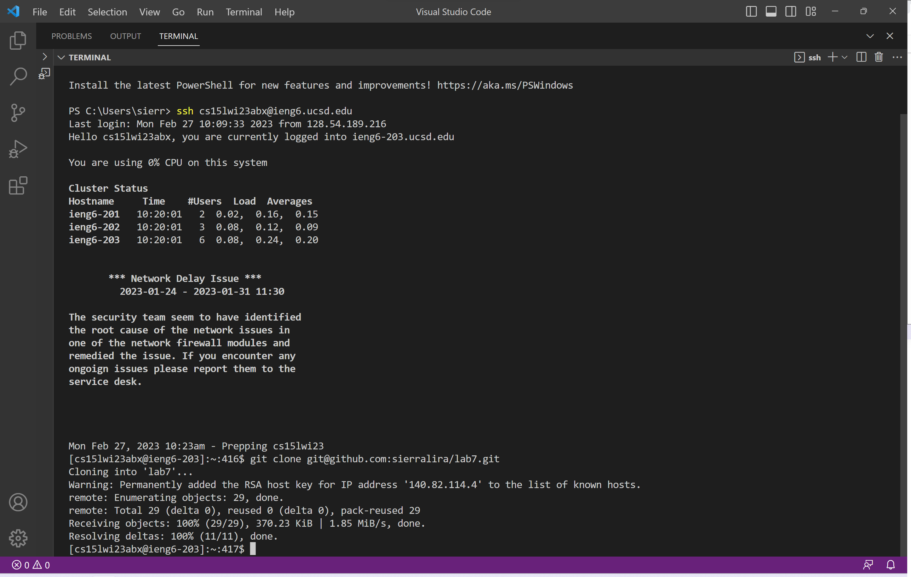

## Lab Report 4: Done Quick
The following lab report will be a reproduction of the week 7 lab for CSE15l during the Winter Quarter of 2023, Done Quick. 
I will explain steps 4-9 from this lab. 

### Step 4: Log into ieng6
What I typed to get this step was `ssh`, `<space>`, `cs15lwi23abx@ieng6.ucsd.edu`, `<enter>`. I had not previously used this 
command, so I had to manually type it in. However, as seen in the image below, I was not prompted to type in my password, as 
I had recently generated a SSH key for ieng6 on this device. 
>

### Step 5: Clone you fork of the repository  from your Github account 
What I typed to get this step was `git`, `<space>`, `clone`, `<space>`, `git@github.com:sierralira/lab7.git`, `<enter>`. I had
not recently used this command, so I had to manually type it in. 
>

### Step 6: Run the tests, demonstrating that they fail
What I typed to get this step was `cd`, `<space>`, `l`, `<tab>`, `<enter>`, `javac -cp .:lib/hamcrest-core-1.3.jar:lib/junit-4.13.2.jar *.java`, 
`<enter>`, `java -cp .:lib/hamcrest-core-1.3.jar:lib/junit-4.13.2.jar org.junit.runner.JUnitCore ListExamplesT`, `<tab>`, `<enter>`. First, I needed to change into the lab7 directory, so I typed `cd`,`<space>`, `l`, and `<tab>` which autocompleted
the name of the directory to `lab7` because I only had one child directory that began with the letter l. In the same way, on the second 
JUnit related command, I only manually typed, `ListExamplesT` and then used '<tab>' to autocomplete the rest. 
>

### Step 7: Edit the code file to fix the failing test
What I typed to get this step was `nano ListExamples.java`, `<ctrl> w`, `while(index2', '<down>`, `<down>`, `<right>`, `<right>`,
`<right>`, `<right>`, `<right>`, `<right>`, `<right>`, `<right>`, `<backspace>`, `2`, `<ctrl> o`, `<enter>`, `<ctrl> x`. I used 
the `nano` command to pull up the editor seen in the image below. Then I used, `<ctrl> w` to search for the text, `while(index2`, to get me 
close to the part of the code I needed to edit. Then I used the arrow keys to get me to the exact part of the code I needed to 
changed. Then I used `<crtl> o` to save and had to press `<enter>` to confirm that I wanted the edited text to save to ListExamples.java. Finally, 
I used `<ctrl> x` to exit the editor. 
>

### Step 8: Run the tests, demonstrating that they now succeed
What I typed to get this step was `<up>`, `<up>`, `<up>`, `<enter>`, `<up>`, `<up>`, `<up>`, `<enter>`. The  `javac -cp .:lib/hamcrest-core-1.3.jar:lib/junit-4.13.2.jar *.java` command was 3 up in 
my history, so I was able to access the command by using the up arrow 3 times. Similarly, the `java -cp .:lib/hamcrest-core-1.3.jar:lib/junit-4.13.2.jar org.junit.runner.JUnitCore ListExamplesTests` 
command was now only 3 up in my history, after using the previous command, so I was able to access the command using the up arrow 3 times as well. 
>

### Step 9: Commit  and push the resulting change to your Github account
What I typed to get this step was `git`, `<space>`, `add`, `<space>`, `ListExamples.java`, `<enter>`, `git`, `<space>`, `commit`, 
 `<space>`, `-m`, `<space>`, `"Updated"`, `<enter>`, `git`, `<space>`, `push`, `<space>`, `o`, `<tab>`, `<space>`, `m`, `<tab>`, 
  `<enter>`. These commands are used to update my repositroy with the changes I made in the terminal. The message `"Updated"` is used to 
  display the update with a message and the `<tab>` used throughout are to autocomplete commands. 
>
