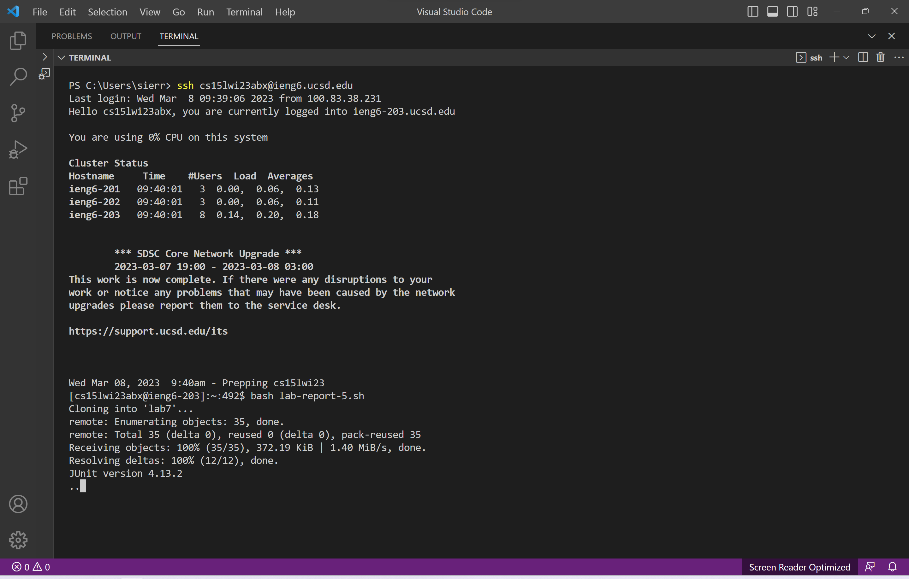

## Lab Report 5
The following lab report will explain how, for lab report 4 (about doing commands quickly), I could have done the task very quickly by writing a bash script.

### Part 1: How I Initially Did The Task
As detailed in Lab Report 4, which can be found at [https://sierralira.github.io/cse15l-lab-reports/lab-report-4.html](https://sierralira.github.io/cse15l-lab-reports/lab-report-4.html), 
to complete the task given in lab of week 7 of CSE15l during the Winter Quarter of 2023, I individually typed the commands necessary to complete the task, with the exception of 
sometimes using my up and down arrows to access my history for commands I already used and wished to use again.

In summary, without using the bash script I had to individually, manually type the following commands, in order: `ssh cs15lwi23abx@ieng6.ucsd.edu`, `cd lab7`, `javac -cp .:lib/hamcrest-core-1.3.jar:lib/junit-4.13.2.jar *.java`,
`java -cp .:lib/hamcrest-core-1.3.jar:lib/junit-4.13.2.jar org.junit.runner.JUnitCore ListExamplesTests`, `nano ListExamples.java`, `javac -cp .:lib/hamcrest-core-1.3.jar:lib/junit-4.13.2.jar *.java`, 
`java -cp .:lib/hamcrest-core-1.3.jar:lib/junit-4.13.2.jar org.junit.runner.JUnitCore ListExamplesTests`, `git add ListExamples.java`, `git commit -m "updated"`, and `git push origin main`.

### Part 2: Doing The Task In A Different Way 
Although we were unable to use a bash script during the lab, creating a bash script to run the commands I used to complete the task allows for the task to completed much 
more quickly. I created a bash script within the remote server using the command `touch lab-report-5.sh` and then used `nano lab-report-5.sh` to type the following code into the file:  

```
set -e
git clone git@github.com:sierralira/lab7.git

cd lab7
javac -cp .:lib/hamcrest-core-1.3.jar:lib/junit-4.13.2.jar *.java
java -cp .:lib/hamcrest-core-1.3.jar:lib/junit-4.13.2.jar org.junit.runner.JUnitCore ListExamplesTests || true

nano ListExamples.java

javac -cp .:lib/hamcrest-core-1.3.jar:lib/junit-4.13.2.jar *.java
java -cp .:lib/hamcrest-core-1.3.jar:lib/junit-4.13.2.jar org.junit.runner.JUnitCore ListExamplesTests || true

git add ListExamples.java
git commit -m "updated"
git push origin main
```

To use this bash script to complete the task given, I first had to log in to the remote server using the command, `ssh cs15lwi23abx@ieng6.ucsd.edu`. I was unable to 
include this command in my bash script because I needed to be in the remote server to use the bash commands. Being logged into the remote server, I was now able to use
bash command to run the command `bash lab-report-5.sh`, lab-report-5.sh being the bash file that contains the commands necessary to complete the task.

>

Within the bash script, `set -e` allows the bash script to continue despite errors. Then, the line `git clone git@github.com:sierralira/lab7.git` clones the lab7 repository in my github 
into the my working directory, we can see this happening by the output, `Cloning into 'lab7' ...`, in the terminal. Then, the line `cd lab7` changes the current 
directory to the lab7 directory. This allows us to run the JUnit tests on the ListExamples.java file, this is done by the lines `javac -cp .:lib/hamcrest-core-1.3.jar:lib/junit-4.13.2.jar *.java` 
and `java -cp .:lib/hamcrest-core-1.3.jar:lib/junit-4.13.2.jar org.junit.runner.JUnitCore ListExamplesTests || true`. It should be noted that the end of the second 
command contains `|| true` so that the bash script continues despite the failed tests. Within the terminal we can see that the JUnit tests are running by the output 
of `JUnit version 4.13.2 ..` in the terminal, followed by the output of the failed test. 

>

Once the line with, `nano ListExamples.java`, runs within the bash script, the text editing interface for ListExamples.java opens. Then I used, `<ctrl> w` to search for the text, `while(index2`, to get me 
close to the part of the code I needed to edit. Then I used the arrow keys to get me to the exact part of the code I needed to 
changed. Then I used `<ctrl> o` to save and had to press `<enter>` to confirm that I wanted the edited text to save to ListExamples.java. Finally, 
I used `<ctrl> x` to exit the editor. 

>

After closing the editor, the bash script continues and the Junit tests run once again, when the lines `javac -cp .:lib/hamcrest-core-1.3.jar:lib/junit-4.13.2.jar *.java` and 
`java -cp .:lib/hamcrest-core-1.3.jar:lib/junit-4.13.2.jar org.junit.runner.JUnitCore ListExamplesTests || true` are hit.  Within the terminal we can see that the JUnit tests are running by the output 
of `JUnit version 4.13.2 ..` in the terminal, and we see that both tests pass because of the output `OK (2 Tests)`. Then the lines `git add ListExamples.java`, 
`git commit -m "updated"`, and `git push origin main` commit and push the changed ListExamples.java file to my github. 

>


